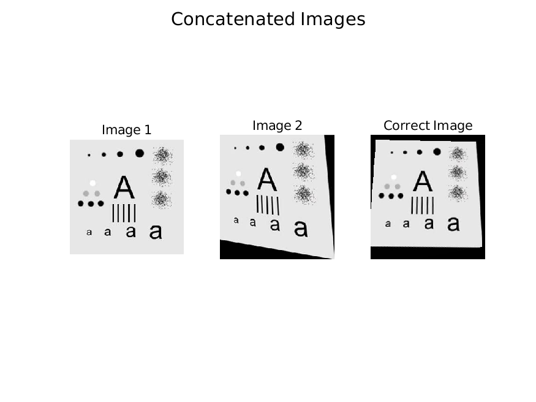

# 数字图像处理与分析 Lab1

**PB22111665 胡揚嘉**

## 实验目的

本次实验主要是通过matlab实现有关 `图像几何变化`的内容。

具体而言包括：

+ 图像平移
+ 图像旋转
+ 图片放缩
+ 图像几何失真校正

本次实验再实践上，由于本身比较简单，故部分实验没有通过调用集成函数实现，而是自己模拟相关实现原理

## 实验内容

### Lab1 图像平移

#### 代码和分析

```matlab
% 读取图像
image = imread('image1.jpg');

% 显示图像
figure;
imshow(image);
title('原图像');

% 获取图像的大小
[height, width, channels] = size(image);

% 获取输入的平移量
hx = input('请输入水平平移量: ');
vy = input('请输入垂直平移量: ');

% for quick test
% hx = 100; % 水平平移量
% vy = 50;  % 垂直平移量

% 创建平移矩阵
move = [1 0 hx; 0 1 vy; 0 0 1];

% 创建一个对应大小的空白图像
new_image = zeros(height, width, channels, 'uint8');
% figure;
% imshow(new_image);

% 对每个像素进行平移
for x = 1:width
    for y = 1:height

        % 原始其次坐标
        original = [x; y; 1];

        % 计算新的坐标
        new = move * original;
        new_x = new(1);
        new_y = new(2);

        % 检查新的坐标是否在图像范围内
        if new_x > 0 && new_x <= width && new_y > 0 && new_y <= height
            % 将原图像的像素值赋值给新图像
            new_image(new_y, new_x, :) = image(y, x, :);
        end
  
    end
end

% 显示平移后的图像
figure;
imshow(new_image);
title('平移后的图像');
```

分析：

1. 核心还是利于原始图像的每个像素点的位置，计算移动后像素点的位置，并且检查是否越界
2. 上述计算移动后的位置，采用齐次坐标乘以变化矩阵实现。

#### 实现结果

> 请输入水平平移呈：45
>
> 请输入垂直平移量：125

自左向右分别是：原图，平移后的结果


### Lab2 图像旋转

#### 代码和分析

```matlab
% 读取图像
image = imread('image1.jpg');

% 显示图像
% figure;
% imshow(image),
% title('原图像');

% 获取图像的大小
[height, width, channels] = size(image);

% 获取输入的平移量
a = input('请输入a: ');
b = input('请输入b: ');
theta = input('请输入theta: ');

% for quick test
% a = 0;
% b = 0;
% theta = 30; % 旋转角度


theta = deg2rad(theta); % 将角度转换为弧度


% 创建并计算移动矩阵
move_re = [1 0 a; 0 1 b; 0 0 1];
rotate  = [cos(theta) -sin(theta) 0; sin(theta) cos(theta) 0; 0 0 1];
move    = [1 0 -a; 0 1 -b; 0 0 1];

mid = move_re * rotate * move;
fact = inv(mid);

% 反向计算新图像的一个点在原图像中的位置

% 创建一个对应大小的空白图像
nearist = zeros(height, width, channels, 'uint8');
bilinear = zeros(height, width, channels, 'uint8');

% 对每个像素进行平移
for x = 1:width
    for y = 1:height

        % 目标扩展坐标
        original = [x; y; 1];

        % 计算原始坐标
        new = fact * original;
        new_x = new(1);
        new_y = new(2);

        if(x==a+1 && y==b+1)
            fprintf('x = %d, y = %d\n', new_x, new_y);
        end

        % 检查新的坐标是否在图像范围内
        if new_x >= 1 && new_x <= width && new_y >= 1 && new_y <= height
            % 最近邻相关
            x_floor = floor(new_x);
            y_floor = floor(new_y);
            x_ceil = ceil(new_x);
            y_ceil = ceil(new_y);
            % 采用最近点法，选取距离最近点的像素赋给新图像
            if (new_x - x_floor) <= (x_ceil - new_x)
                new_x = x_floor;
            else
                new_x = x_ceil;
            end
            if (new_y - y_floor) <= (y_ceil - new_y)
                new_y = y_floor;
            else
                new_y = y_ceil;
            end
            nearist(y, x, :) = image(new_y, new_x, :); % 最近邻插值法
        end
        % 双线性插值
        if new_x >= 2 && new_x <= width - 2 && new_y >= 2 && new_y <= height - 2
  
            x_1 = floor(new_x);
            x_2 = floor(new_x) + 1;
            x_3 = floor(new_x);
            x_4 = floor(new_x) + 1;

            y_1 = floor(new_y);
            y_2 = floor(new_y);
            y_3 = floor(new_y) + 1;
            y_4 = floor(new_y) + 1;

            p1 = image(y_1, x_1, :);
            p2 = image(y_2, x_2, :);
            p3 = image(y_3, x_3, :);
            p4 = image(y_4, x_4, :);
  
            s = new_x - x_1;
            t = new_y - y_1;
            bilinear(y, x, :) = (1 - s) * (1 - t) * p1 + (1 - s) * t * p3 + (1 - t) * s * p2 + s * t * p4; % 双线性插值法
        end
    end
end

% 显示平移后的图像
figure;
imshow(nearist),
title('最近邻');

figure;
imshow(bilinear),
title('双线性');

```

分析：

1. 上述计算移动后的位置，采用齐次坐标乘以变化矩阵实现。但是不同的是：

   利于目的图像的每个像素点的位置，计算移动前像素点的位置，并且检查是否越界，分别利用最近邻插值和双线性插值实现
2. 变化矩阵的计算，采用了平移矩阵和旋转矩阵的组合实现，并且需要求逆(满足上述的 `倒求`的思想)

#### 实现结果

> 请输入a：130
> 请输入b：145
> 请输入theta：30

自左向右分别是：原图，最近邻插值，双线性插值的结果


### Lab3 图像放缩

#### 代码和分析

```matlab
% 读取图像
image = imread('image1.jpg');

% 获取图像的大小
[height, width, channels] = size(image);

% 获取输入的平移量
% a = input('请输入a: ');
% b = input('请输入b: ');

% for quick test
a = 2;
b = 2;

% 计算真的平移量
% a = a+width/2;
% b = b+height/2;


% 创建并计算移动矩阵
fact = [a 0 0; 0 b 0; 0 0 1];
fact = fact';

% 反向计算新图像的一个点在原图像中的位置

% 创建一个对应大小的空白图像
nearist = zeros(height, width, channels, 'uint8');
bilinear = zeros(height, width, channels, 'uint8');

% 对每个像素进行平移
for x = 1:width
    for y = 1:height

        % 目标扩展坐标
        original = [x; y; 1];

        % 计算原始坐标
        new = fact * original;
        new_x = new(1);
        new_y = new(2);

        % if(x==a+1 && y==b+1)
        %     fprintf('x = %d, y = %d\n', new_x, new_y);
        % end

        % 检查新的坐标是否在图像范围内
        if new_x >= 1 && new_x <= width && new_y >= 1 && new_y <= height
            % 最近邻相关
            x_floor = floor(new_x);
            y_floor = floor(new_y);
            x_ceil = ceil(new_x);
            y_ceil = ceil(new_y);
            % 采用最近点法，选取距离最近点的像素赋给新图像
            if (new_x - x_floor) <= (x_ceil - new_x)
                new_x = x_floor;
            else
                new_x = x_ceil;
            end
            if (new_y - y_floor) <= (y_ceil - new_y)
                new_y = y_floor;
            else
                new_y = y_ceil;
            end
            nearist(y, x, :) = image(new_y, new_x, :); % 最近邻插值法
        end
        % 双线性插值
        if new_x >= 2 && new_x <= width - 2 && new_y >= 2 && new_y <= height - 2
    
            x_1 = floor(new_x);
            x_2 = floor(new_x) + 1;
            x_3 = floor(new_x);
            x_4 = floor(new_x) + 1;

            y_1 = floor(new_y);
            y_2 = floor(new_y);
            y_3 = floor(new_y) + 1;
            y_4 = floor(new_y) + 1;

            p1 = image(y_1, x_1, :);
            p2 = image(y_2, x_2, :);
            p3 = image(y_3, x_3, :);
            p4 = image(y_4, x_4, :);
    
            s = new_x - x_1;
            t = new_y - y_1;
            bilinear(y, x, :) = (1 - s) * (1 - t) * p1 + (1 - s) * t * p3 + (1 - t) * s * p2 + s * t * p4; % 双线性插值法
        end
    end
end

% 显示平移后的图像
figure;
imshow(nearist),
title('最近邻');

figure;
imshow(bilinear),
title('双线性');
```

分析：

1. 相关思想完全复用 `图像旋转` 所用的方法
2. 需要注意的是，不同点仅在于变化矩阵

#### 实现结果

> 请输入a:2
> 请输入b:1.5

自左向右分别是：原图，最近邻插值，双线性插值的结果


### Lab4 几何失真的校正

#### 代码和分析

```matlab
% open a picture
ab2 = imread('alphabet2.jpg');
ab1 = imread("alphabet1.jpg");

[mp, fp] = cpselect(ab2, ab1, 'Wait', true);

% get the coordinates of the points
tform = fitgeotrans(mp, fp, 'projective');
correct = imwarp(ab2, tform, 'OutputView', imref2d(size(ab2)));

figure;
imshow(correct);
title('Corrected Image');
```

分析：

```matlab
[mp, fp] = cpselect(ab2, ab1, 'Wait', true);
```

这行代码调用了 `cpselect` 函数，该函数允许用户交互式地在两张图像上选择控制点（control points）。`mp` 和 `fp` 分别存储了在第一张图 (`ab2`) 和第二张图 (`ab1`) 上选择的控制点的坐标。参数 `'Wait', true` 使得程序暂停，等待用户完成控制点的选择。

```matlab
% 获取点的坐标
tform = fitgeotrans(mp, fp, 'projective');
```

这行代码使用了 `fitgeotrans` 函数来拟合一个几何变换（在这里是投影变换），将第一张图上的控制点映射到第二张图上的对应控制点。`tform` 变量存储了这个变换的参数。

```matlab
correct = imwarp(ab2, tform, 'OutputView', imref2d(size(ab2)));
```

这行代码使用了 `imwarp` 函数来应用之前计算的几何变换 `tform` 到第一张图 `ab2` 上，从而得到校正后的图像 `correct`。参数 `'OutputView', imref2d(size(ab2))` 确保输出图像与输入图像具有相同的尺寸。

总结：

- `cpselect` 允许用户在两张图像上选择控制点。
- `fitgeotrans` 根据控制点拟合几何变换。
- `imwarp` 应用几何变换到图像上以进行校正。

#### 实现结果

> 输入通过 `cpselect`函数的选点实现

自左向右分别是：标准图像，失真图像，校正图像




## 实验总结

1. 本次实验主要是通过matlab实现有关 `图像几何变化`的内容。
2. 通过本次实验，熟悉了图像的平移、旋转、放缩等几何变化的实现原理，熟悉了图像的几何失真校正的实现原理。
4. 熟悉了matlab中图像处理的相关函数的使用和不使用函数逐点处理图像的方式。以及图像的插值方法的实现原理。
