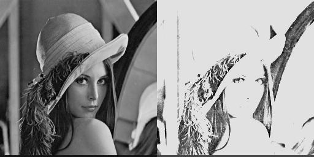

# 数字图像处理与分析 Lab2

**PB22111665 胡揚嘉**

## 实验目的

本次实验主要是通过matlab实现有关图像点处理增强的问题

这里的主要研究对象是图像的像素的灰度，以及图像整体的灰度分布，以及在这两个视角对图像进行处理，研究其对图像产生的影响。

具体而言包括：

+ 灰度线性变换
+ 灰度放缩、拉伸
+ 输出灰度直方图
+ 在直方图level上，进行图像直方图均衡

## 实验内容

### Lab1 灰度线性变换

#### 代码和分析

```matlab
% 读取图像
image = imread('/home/ubuntu/Downloads/matlab/lab2/fig/image1.bmp');

% 显示图像
figure;
imshow(image);
title('原图像');


% 获取输入的平移量
k = input('请输入斜率: ');
b = input('请输入截距: ');

% for quick test
% k = 1; % 水平平移量
% b = 20;  % 垂直平移量

new_image = image * k + b;
% 显示平移后的图像

figure;
imshow(new_image);
title('平移后的图像');

% 水平拼接两张图像
img_concatenated = cat(2, image, new_image);

% 保存拼接后的图像
imwrite(img_concatenated, '/home/ubuntu/Downloads/matlab/lab2/fig/image1_move.jpg');
```

分析：

1. 对于每个像素，进行一个线性变换，代码是`new_image = image * k + b;`

   经过查证，这里`uint8`类型如果运算超出[0, 255]的范围限制，会自动截取

#### 实现结果

> 请输入斜率：5
>
> 请输入截距：-30

自左向右分别是：原图，线性变化的结果



视觉上可以感受到，线性变化使得图像更加明亮。

### Lab2 灰度拉伸

#### 代码和分析

```matlab
% 读取图像
image = imread('/home/ubuntu/Downloads/matlab/lab2/fig/image1.bmp');

% 显示图像
figure;
imshow(image);
title('原图像');


% 获取输入的平移量
x1 = input('请输入x1: ');
y1 = input('请输入y1: ');
x2 = input('请输入x2: ');
y2 = input('请输入y2: ');

% for quick test
% x1 = 50;
% y1 = 20;
% x2 = 200;
% y2 = 230;


[m, n] = size(image); 
new_image = zeros(m, n);
for i = 1 : m
    for j = 1 : n
        if (image(i, j) < x1)
            temp = y1 / x1 * image(i, j);
        elseif (image(i, j) <= x2)
            temp = (y2 - y1)/(x2 - x1) * (image(i, j) - x1) + y1;
        else
            temp = (255 - y2) / (255 - x2) * (image(i, j) - x2) + y2;
        end


        temp = round(temp);
        if (temp < 0)
            temp = 0;
        elseif (temp > 255)
            temp = 255;
        end
%         temp
        new_image(i, j) = temp;
    end
end


% figure;
% imshow(new_image);
% title('平移后的图像');

% 水平拼接两张图像
img_concatenated = cat(2, image, new_image);
imshow(img_concatenated)
% 保存拼接后的图像
imwrite(img_concatenated, '/home/ubuntu/Downloads/matlab/lab2/fig/image2_move.jpg');
```

分析：

1. 对于某个灰度区间`[x1,x2]`，将其映射到`[y1,y2]`。
   + 如果$$y2-y1=x2-x1$$，相当于一个平移运算
   + 如果$$y2-y1>x2-x1$$，本质上是一个拉伸运算
   + 如果$$y2-y1<x2-x1$$，本质上是一个压缩运算
2. 代码实现上。遍历每一个像素点，找到其属于的变化区间，执行对于的变化函数，最后特别需要检查是否越界并且执行越界截取，最后输出结果、。

#### 实现结果

> % x1 = 50;
> % y1 = 20;
> % x2 = 200;
> % y2 = 230;


在视觉上，可以看到，拉伸的结果使得图像的对比度增强了，细节更加明显。低灰度和高灰度呗压缩，中间被拉伸了。

### Lab3 灰度直方图

#### 代码和分析

```matlab
% 读取图像
image = imread('/home/ubuntu/Downloads/matlab/lab2/fig/pout.bmp');

% 显示图像
figure;
imshow(image);
title('原图像');

% low = input("input low: ");
% high = input("input high: ");

% for quick test
low = 50;
high = 200;


gray_range = [low, high];
num_bins = diff(gray_range) + 1;
counts = histcounts(image, num_bins, 'BinLimits', gray_range); 
bar(gray_range(1):gray_range(2), counts); % 显示灰度直方图
xlim([low high]); % 设置X轴范围
xlabel('Gray level'); % 设置X轴标签
ylabel('Count'); % 设置Y轴标签

% 保存直方图
saveas(gcf, '/home/ubuntu/Downloads/matlab/lab2/fig/histogram.png'); % 保存为PNG格式
```

分析：

1. 灰度直方图的思想是：统计整个图像，每一个像素的灰度，并且将其转化为一个图表以供参考
1. `histcounts`: 这是 MATLAB 中用于计算直方图计数的函数。它统计输入数据落在指定箱（bin）中的数量。这个函数主要实现了统计直方图的功能。

#### 实现结果


清晰的展示了图像的灰度分布情况


### Lab4 直方图均衡化

#### 代码和分析

```matlab
image = imread('/home/ubuntu/Downloads/matlab/lab2/fig/pout.bmp');
subplot(3,2,1);
imshow(image);
title('原始图像');
subplot(3,2,2);
% histogram函数，用于显示图像的直方图
histogram(image);
title('原始图像直方图');

% histeq函数用于直方图均衡化
image2 = histeq(image);
subplot(3,2,3);
imshow(image2);
title('直方图均衡化后的图像');
subplot(3,2,4);
histogram(image2);
title('直方图均衡化后的图像直方图');


% 规定化需要一个目标直方图，而且是高斯分布的，使用 normpdf((0:1:255), 128, 50)产生
% normpdf(x,mu,sigma)，由于像素是离散的256哥点，所以x=0:1:255，均值mu=128，标准差sigma=50是自己设置的
image3 = histeq(image, normpdf((0:1:255), 128, 50));
subplot(3,2,5);
imshow(image3);
title('直方图规定化后的图像');
subplot(3,2,6);
histogram(image3);
title('直方图规定化后的图像直方图');
```


总结：

- 这里执行了两种变化。第一种是均衡化，第二种是规定化，并且指定的是高斯分布
- `image2 = histeq(image);`不加其他参数，执行直方图均衡化，期望最后输出的直方图更加均衡，各个灰度的出现频率相当
- `image3 = histeq(image, normpdf((0:1:255), 128, 50));`加上一个参数，指定希望规定化的情形，本质上是，这使用` normpdf((0:1:255), 128, 50)`产生通过一个高斯分布的目标直方图

#### 实现结果


1. 对比原始与均衡化
   1. 图像上，均衡化后，图像的对比度增强了，细节更加明显
   2. 直方图上，均衡化后，灰度分布更加均匀。但是由于原始图像的灰度分布不均匀，所以均衡化后，仍然有一些灰度值的出现频率较高
2. 对比原始与规定化
   1. 图像上，规定化后，图像的对比度增强了，细节更加明显。但是不如均衡化的效果明显
   2. 直方图上，规定化后，灰度分布符合高斯分布的形状

## 实验总结

1. 本次实验主要是通过matlab实现有关 `图像点处理增强`的内容。主要通过像素角度和直方图角度进行分析
2. 通过本次实验，熟悉了图像的灰度的操控与处理，又通过矩阵运算批量处理 的简单情况，也有全局遍历，按照自己的需求针对性处理的复杂方法
3. 还探究了与直方图相关的情况，包括输出直方图，在直方图的基础上进行处理等。
