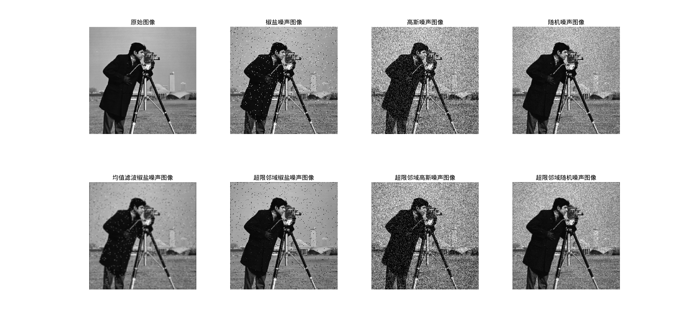

# 数字图像处理与分析 Lab3

**PB22111665 胡揚嘉**

## 实验目的

本次实验主要是通过matlab实现有关空间域滤波的问题

这里的主要研究对象是图像的空间域层面上，怎么对噪声进行处理，具体常用的方法是各种滤波。

更加明确的说，实质上是在每个像素的邻域，观察其是否在满足一定的`噪声`特性，按照一定的阈值原则进行筛选，以期达到滤波的效果，最重要的是，观察其对图像边缘的区分和模糊影响

具体而言包括：

+ 均值滤波和超限邻域平均法
+ 中值滤波和超限中值滤波
+ 前四种方法的对比
+ 边缘检测的算法，包括一阶算子和二阶算子

## 实验内容

### Lab1 生成对应的噪声图像

#### 代码和分析

```matlab
% 用原始图像 lena.bmp 或 cameraman.bmp 分别加产生的 3%椒盐噪声、高斯噪声、随机噪声合成有噪声的图像并显示

image = imread("/home/ubuntu/Downloads/matlab/lab3/fig/cameraman.bmp");

% 添加椒盐噪声
pepper_noise = imnoise(image, 'salt & pepper', 0.03);

% 添加高斯噪声 , mu=0, sigma=0.1
gaussian_noise = imnoise(image, 'gaussian', 0, 0.03); 

% 添加随机噪声(乘性噪声)
random_noise = imnoise(image, 'speckle', 0.03);

% 显示原始图像和噪声图像
subplot(2, 2, 1);
imshow(image);
title('原始图像');

subplot(2, 2, 2);
imshow(pepper_noise);
title('椒盐噪声图像');

subplot(2, 2, 3);
imshow(gaussian_noise);
title('高斯噪声图像');

subplot(2, 2, 4);
imshow(random_noise);
title('随机噪声图像');


% 保存相关图像
saveas(gcf, '/home/ubuntu/Downloads/matlab/lab3/fig/subplot.png');
filename = '/home/ubuntu/Downloads/matlab/lab3/fig/'; % 定义文件名
imwrite(pepper_noise, [filename  'pepper_noise.png']); % 保存椒盐噪声图像
imwrite(gaussian_noise, [filename 'gaussian_noise.png']); % 保存高斯噪声图像
imwrite(random_noise, [filename 'random_noise.png']); % 保存随机噪声图像
```

分析：

1. 对于每个图像，生成对应的含有`3%椒盐噪声、高斯噪声、随机噪声`的图像

2. 使用函数`imnoise`实现，指定添加噪声的类型和噪声的水平，

   高斯噪声是均值和方差

   随机噪声和椒盐噪声是噪声的水平

#### 实现结果


下面所有的处理和分析都基于这样的噪声图像进行

### Lab2 均值滤波

#### 代码和分析

```matlab
% 均值滤波

filename = '/home/ubuntu/Downloads/matlab/lab3/fig/';
image = imread([filename 'cameraman.bmp']);
image_pepper = imread([filename 'pepper_noise.png']);
image_gaussian = imread([filename 'gaussian_noise.png']);
image_random = imread([filename 'random_noise.png']);

% 均值滤波
filter_average = fspecial('average', 3);

image_average_pepper = imfilter(image_pepper, filter_average);
image_average_gaussian = imfilter(image_gaussian, filter_average);
image_average_random = imfilter(image_random, filter_average);

% 显示原始图像和均值滤波图像
subplot(2, 4, 1);
imshow(image);
title('原始图像');

subplot(2, 4, 2);
imshow(image_pepper);
title('椒盐噪声图像');

subplot(2, 4, 3);
imshow(image_gaussian);
title('高斯噪声图像');

subplot(2, 4, 4);
imshow(image_random);
title('随机噪声图像');

subplot(2, 4, 6);
imshow(image_average_pepper);
title('均值滤波椒盐噪声图像');

subplot(2, 4, 7);
imshow(image_average_gaussian);
title('均值滤波高斯噪声图像');

subplot(2, 4, 8);
imshow(image_average_random);
title('均值滤波随机噪声图像');

% 调整子图间距
set(gcf, 'Position', get(0,'Screensize')); % 使图形窗口最大化
% subplots_adjust('hspace', 0.5); % 增加垂直间距

% 保存均值滤波结果
saveas(gcf, [filename 'subplot_average.png']);
```

分析：

1. 将以像素为中心，[3，3]范围的像素灰度求均值，作为当下图像的灰度
2. `fspecial('average', 3);`指定滤波函数，这里指定到3*3的均值滤波
3. `imfilter(image_pepper, filter_average);`将生成的滤波器执行到每种带噪图像上，得到结果

#### 实现结果


可以观察得到：

1. 均值滤波对椒盐噪声效果很好，但是对随机噪声和高斯噪声效果不好

   1. 原因是：椒盐噪声通常是图像中的稀疏、孤立的高亮或低亮像素点，均值滤波通过取邻域像素的平均值，可以有效平滑这些孤立点，从而去除椒盐噪声。然而，随机噪声和高斯噪声通常在整个图像中分布较为均匀，且其强度变化较为平滑，均值滤波在平滑这些噪声的同时，也会平滑掉图像的细节和边缘信息，导致去噪效果不佳。

2. 均值滤波会对图像的边缘产生模糊现象，原因是：均值滤波在计算每个像素的新值时，考虑了其邻域内所有像素的值，包括边缘两侧的像素。这会导致边缘两侧的像素值相互影响，从而模糊了边缘的界限。

   可能的解决方法是：采用超限均值滤波

### Lab3 超限均值滤波

#### 代码和分析

```matlab
% 似乎没有直接的函数实现

% 与均值滤波，相比，每个像素在均值前后的差值决定了选择均值还是原值，可以利用这一点做文章
filename = '/home/ubuntu/Downloads/matlab/lab3/fig/';
image = imread([filename 'cameraman.bmp']);
image_pepper = imread([filename 'pepper_noise.png']);
image_gaussian = imread([filename 'gaussian_noise.png']);
image_random = imread([filename 'random_noise.png']);

% 均值滤波
filter_average = fspecial('average', 3);

% image_average_pepper_tmp = imfilter(image_pepper, filter_average);
% image_average_gaussian_tmp = imfilter(image_gaussian, filter_average);
% image_average_random_tmp = imfilter(image_random, filter_average);

image_average_pepper = myFun(image_pepper);
image_average_gaussian = myFun(image_gaussian);
image_average_random = myFun(image_random);

% 显示原始图像和均值滤波图像
subplot(2, 4, 1);
imshow(image);
title('原始图像');

subplot(2, 4, 2);
imshow(image_pepper);
title('椒盐噪声图像');

subplot(2, 4, 3);
imshow(image_gaussian);
title('高斯噪声图像');

subplot(2, 4, 4);
imshow(image_random);
title('随机噪声图像');

subplot(2, 4, 6);
imshow(image_average_pepper);
title('超限邻域椒盐噪声图像');

subplot(2, 4, 7);
imshow(image_average_gaussian);
title('超限邻域高斯噪声图像');

subplot(2, 4, 8);
imshow(image_average_random);
title('超限邻域随机噪声图像');

subplot(2, 4, 5);
imshow(imfilter(image_pepper, filter_average));
title('均值滤波椒盐噪声图像');

% 调整子图间距
set(gcf, 'Position', get(0,'Screensize')); % 使图形窗口最大化

% 保存均值滤波结果
saveas(gcf, [filename 'subplot_overlimit.png']);


function result = myFun(input)
%myFun - Description
%
% Syntax: output = myFun(input)
%
% Long description
    % 得到均值滤波后的图像
    filter_average = fspecial('average', 3);
    image_tmp = imfilter(input, filter_average);
    
    % 计算差值
    T = 50;
    place = abs(input - image_tmp) > T;

    % 应用超限邻域平均法
    result = input; 
    result(place) = image_tmp(place); 
    % 返回结果
    return;
end

```

分析：

1. 这里构造了自己的函数`myFun`，实现超限均值滤波
   ```matlab
   function result = myFun(input)
   %myFun - Description
   %
   % Syntax: output = myFun(input)
   %
   % Long description
      % 得到均值滤波后的图像
      filter_average = fspecial('average', 3);
      image_tmp = imfilter(input, filter_average);
      
      % 计算差值
      T = 50;
      place = abs(input - image_tmp) > T;
   
      % 应用超限邻域平均法
      result = input; 
      result(place) = image_tmp(place); 
      % 返回结果
      return;
   end
   ```
   1. 这里的`T`是一个阈值，决定了是否使用均值滤波的标准
   2. `place = abs(input - image_tmp) > T;`计算差值，决定是否使用均值滤波。place是一个逻辑矩阵，表示哪些像素的差值超过了阈值T
   3. `result(place) = image_tmp(place);`应用超限邻域平均法
   4. 思想上，给出均值滤波的结果，然后通过`place`决定哪些像素点使用均值滤波的结果

#### 实现结果



1. 我将均值和超限均值在椒盐噪声上进行了对比
   1. 去噪效果上：超限的均值滤波比均值滤波效果差
   2. 边缘保留上：超限均值滤波比均值滤波效果好，更加清晰
2. 均值滤波对椒盐噪声效果很好，但是对随机噪声和高斯噪声效果不好。这在超限均值滤波上也同样成立，而且由于阈值的存在，去噪效果更差
3. 总结：合理的选择一种阈值是关键的，这是在边缘模糊和噪声清除之间做一个权衡

### Lab4 中值滤波

#### 代码和分析

```matlab
% 中值滤波器

filename = '/home/ubuntu/Downloads/matlab/lab3/fig/';
image = imread([filename 'cameraman.bmp']);
image_pepper = imread([filename 'pepper_noise.png']);
image_gaussian = imread([filename 'gaussian_noise.png']);
image_random = imread([filename 'random_noise.png']);


% 中值滤波
image_median_pepper = medfilt2(image_pepper, [3 3]);
image_median_gaussian = medfilt2(image_gaussian, [3 3]);
image_median_random = medfilt2(image_random, [3 3]);

% 显示原始图像和中值滤波图像
subplot(2, 4, 1);
imshow(image);
title('原始图像');

subplot(2, 4, 2);
imshow(image_pepper);
title('椒盐噪声图像');

subplot(2, 4, 3);
imshow(image_gaussian);
title('高斯噪声图像');

subplot(2, 4, 4);
imshow(image_random);
title('随机噪声图像');

subplot(2, 4, 6);
imshow(image_median_pepper);
title('中值滤波椒盐噪声图像');

subplot(2, 4, 7);
imshow(image_median_gaussian);
title('中值滤波高斯噪声图像');

subplot(2, 4, 8);
imshow(image_median_random);
title('中值滤波随机噪声图像');

saveas(gcf, [filename 'subplot_median.png']);

```


分析：

1. `medfilt2` 函数实现中值滤波，
   1. `medfilt2(image_pepper, [3 3]);`表示对图像进行中值滤波，窗口大小为3*3
   2. 中值滤波是通过对每个像素点的邻域内的像素值进行排序，然后取中间值作为当前像素的新值。这样可以有效去除椒盐噪声，同时保留图像的边缘信息


#### 实现结果


1. 中值滤波对椒盐噪声效果很好，对高斯噪声和随机噪声效果也不错(相比均值滤波)，而且由于中值滤波的特性，对图像的边缘保留效果也很好
   1. 对于椒盐噪声，由于噪声点往往是孤立的变化值，中值滤波可以有效地将这些孤立的噪声点替换为邻域内的中值，从而去除噪声
2. 中值滤波对高斯噪声和随机噪声的去噪效果相对较好，但仍然会对图像的细节产生一定的模糊影响
3. 对于高斯噪声和随机噪声，由于噪声的分布较为平滑，中值滤波的过滤效果也比较差，但是从视觉的肉眼层次上，噪声程度有所减弱


### Lab5 超限中值滤波
#### 代码和分析

```matlab
% 超限中值滤波器去除图像中的噪声


filename = '/home/ubuntu/Downloads/matlab/lab3/fig/';
image = imread([filename 'cameraman.bmp']);
image_pepper = imread([filename 'pepper_noise.png']);
image_gaussian = imread([filename 'gaussian_noise.png']);
image_random = imread([filename 'random_noise.png']);


image_median_pepper = myFun(image_pepper);
image_median_gaussian = myFun(image_gaussian);
image_median_random = myFun(image_random);

% 显示原始图像和均值滤波图像
subplot(2, 4, 1);
imshow(image);
title('原始图像');

subplot(2, 4, 2);
imshow(image_pepper);
title('椒盐噪声图像');

subplot(2, 4, 3);
imshow(image_gaussian);
title('高斯噪声图像');

subplot(2, 4, 4);
imshow(image_random);
title('随机噪声图像');

subplot(2, 4, 6);
imshow(image_median_pepper);
title('超限中值椒盐噪声图像');

subplot(2, 4, 7);
imshow(image_median_gaussian);
title('超限中值高斯噪声图像');

subplot(2, 4, 8);
imshow(image_median_random);
title('超限中值随机噪声图像');

subplot(2, 4, 5);
imshow(medfilt2(image_pepper, [3 3]));
title('中值滤波椒盐噪声图像');


% 调整子图间距
set(gcf, 'Position', get(0,'Screensize')); % 使图形窗口最大化

% 保存滤波结果
saveas(gcf, [filename 'subplot_overlimit_median.png']);


function result = myFun(input)
    % 得到中值滤波后的图像
    image_tmp = medfilt2(input, [3 3]);
    
    % 计算差值
    T = 20;
    place = abs(input - image_tmp) > T;

    % 应用超限中值平均法
    result = input; 
    result(place) = image_tmp(place); 
    % 返回结果
    return;
end

```

分析：

1. 思路同超限均值与均值一样，实现超限中值
   1. `myFun`函数实现超限中值滤波
      ```matlab
      function result = myFun(input)
         % 得到中值滤波后的图像
         image_tmp = medfilt2(input, [3 3]);
         
         % 计算差值
         T = 20;
         place = abs(input - image_tmp) > T;
      
         % 应用超限中值平均法
         result = input; 
         result(place) = image_tmp(place); 
         % 返回结果
         return;
      end
      ```

   2. `image_tmp = medfilt2(input, [3 3]);`得到中值滤波后的图像
   3. `place = abs(input - image_tmp) > T;`计算差值，决定是否使用中值滤波。
   4. `T`是一个阈值，决定了是否使用中值滤波的标准  


#### 实现结果


1. 超限中值滤波对椒盐噪声效果很好，对高斯噪声和随机噪声效果也较差，
   1. 对于椒盐噪声，相比中值滤波，超限滤波由于阈值的存在，让更多的噪声被保留，肉眼可见，有了更多的残余噪声点。
   2. 对于高斯噪声和随机噪声，由于噪声的分布较为平滑，中值滤波的过滤效果也比较差，但是从视觉的肉眼层次上，噪声程度有所减弱


### Lab6 四种方法的对比

#### 代码和分析

```matlab
% 多种方式比较

filename = '/home/ubuntu/Downloads/matlab/lab3/fig/';
image = imread([filename 'cameraman.bmp']);
image_pepper = imread([filename 'pepper_noise.png']);
image_gaussian = imread([filename 'gaussian_noise.png']);
image_random = imread([filename 'random_noise.png']);


% 均值滤波
filter_average = fspecial('average', 3);
image_average_pepper = imfilter(image_pepper, filter_average);
image_average_gaussian = imfilter(image_gaussian, filter_average);
image_average_random = imfilter(image_random, filter_average);

% 中值滤波
image_median_pepper = medfilt2(image_pepper, [3 3]);
image_median_gaussian = medfilt2(image_gaussian, [3 3]);
image_median_random = medfilt2(image_random, [3 3]);

% 超限邻域平均法
image_overaverage_pepper = over_average(image_pepper);
image_overaverage_gaussian = over_average(image_gaussian);
image_overaverage_random = over_average(image_random);

% 超限邻域中值法
image_overmedian_pepper = over_median(image_pepper);
image_overmedian_gaussian = over_median(image_gaussian);
image_overmedian_random = over_median(image_random);

% 显示所有
subplot(5, 4, [1, 5, 9, 13, 17]);imshow(image);title('原始图像');
subplot(5, 4, 2);imshow(image_pepper);title('椒盐噪声图像');
subplot(5, 4, 3);imshow(image_gaussian);title('高斯噪声图像');
subplot(5, 4, 4);imshow(image_random);title('随机噪声图像');
subplot(5, 4, 6);imshow(image_average_pepper);title('均值滤波椒盐噪声图像');
subplot(5, 4, 7);imshow(image_average_gaussian);title('均值滤波高斯噪声图像');
subplot(5, 4, 8);imshow(image_average_random);title('均值滤波随机噪声图像');
subplot(5, 4, 10);imshow(image_median_pepper);title('中值滤波椒盐噪声图像');
subplot(5, 4, 11);imshow(image_median_gaussian);title('中值滤波高斯噪声图像');
subplot(5, 4, 12);imshow(image_median_random);title('中值滤波随机噪声图像');
subplot(5, 4, 14);imshow(image_overaverage_pepper);title('超限邻域平均椒盐噪声图像');
subplot(5, 4, 15);imshow(image_overaverage_gaussian);title('超限邻域平均高斯噪声图像');
subplot(5, 4, 16);imshow(image_overaverage_random);title('超限邻域平均随机噪声图像');
subplot(5, 4, 18);imshow(image_overmedian_pepper);title('超限邻域中值椒盐噪声图像');
subplot(5, 4, 19);imshow(image_overmedian_gaussian);title('超限邻域中值高斯噪声图像');
subplot(5, 4, 20);imshow(image_overmedian_random);title('超限邻域中值随机噪声图像');

% 调整子图间距
set(gcf, 'Position', get(0,'Screensize')); % 使图形窗口最大化

saveas(gcf, [filename 'subplot_all.png']);


function result = over_average(input)
    % 得到均值滤波后的图像
    filter_average = fspecial('average', 3);
    image_tmp = imfilter(input, filter_average);
    
    % 计算差值
    T = 50;
    place = abs(input - image_tmp) > T;

    % 应用超限邻域平均法
    result = input; 
    result(place) = image_tmp(place); 
    % 返回结果
    return;
end

function result = over_median(input)
    % 得到中值滤波后的图像
    image_tmp = medfilt2(input, [3 3]);
    
    % 计算差值
    T = 20;
    place = abs(input - image_tmp) > T;

    % 应用超限中值平均法
    result = input; 
    result(place) = image_tmp(place); 
    % 返回结果
    return;
end
    
```

分析：

1. 代码层面，其实就是将前面提到的所有方法都集成在一起，相关自己设定的函数已经分析过，不再赘述

#### 实现结果


分析：

1. 对于超限均值和超限中值，其与不超限的优劣和作用已经在前文进行了分析，不再赘述，下面分析两种方法本身的不同点。
2. 中值与均值
   1. 边缘处理上：
      1. 中值滤波对图像的边缘保留效果更好，因为它不会受到极端值的影响，而均值滤波会受到极端值的影响，导致边缘模糊
   2. 噪声处理上：
      1. 中值滤波对椒盐噪声的去噪效果更好，因为它可以有效地去除孤立的噪声点，而均值滤波会将这些孤立的噪声点平滑掉，导致图像模糊
3. 椒盐噪声、高斯噪声、随机噪声的处理上：
   1. 均值滤波对椒盐噪声效果很好，但是对随机噪声和高斯噪声效果不好
   2. 中值滤波对椒盐噪声效果很好，对高斯噪声和随机噪声效果也不错(相比均值滤波)，而且由于中值滤波的特性，对图像的边缘保留效果也很好
   3. 超限均值和超限中值在椒盐噪声上都表现得不如均值和中值，原因是阈值的存在让更多的噪声被保留，肉眼可见，有了更多的残余噪声点
   4. 对于高斯噪声和随机噪声，由于噪声的分布较为平滑，中值滤波和均值滤波的过滤效果也比较差，但是从视觉的肉眼层次上，噪声程度有所减弱


### Lab7 边缘检测

#### 代码和分析

```matlab
% 多种算子做边缘检测

filename = '/home/ubuntu/Downloads/matlab/lab3/fig/';
lena = imread([filename 'lena.bmp']);
blood = imread([filename 'blood.bmp']);

% Roberts算子
lena_roberts = edge(lena, 'Roberts');
blood_roberts = edge(blood, 'Roberts');

% Sobel算子
lena_sobel = edge(lena, 'Sobel');
blood_sobel = edge(blood, 'Sobel');

% Prewitt算子
lena_prewitt = edge(lena, 'Prewitt');
blood_prewitt = edge(blood, 'Prewitt');


% 拉普拉斯
result_lena = laplacian_edge_detection(lena);
lena_laplacian1 = result_lena{1}; % 使用第一个拉普拉斯结果
lena_laplacian2 = result_lena{2}; % 使用第二个拉普拉斯结果

result_blood = laplacian_edge_detection(blood);
blood_laplacian1 = result_blood{1}; % 使用第一个拉普拉斯结果
blood_laplacian2 = result_blood{2}; % 使用第二个拉普拉斯结果


% Canny算子
lena_canny = edge(lena, 'Canny');
blood_canny = edge(blood, 'Canny');

% 显示图像
figure;
subplot(2, 7, 1); imshow(lena); title('lena');
subplot(2, 7, 2); imshow(lena_roberts); title('Roberts');
subplot(2, 7, 3); imshow(lena_sobel); title('Sobel');
subplot(2, 7, 4); imshow(lena_prewitt); title('Prewitt');
subplot(2, 7, 5); imshow(lena_laplacian1); title('Laplacian4');
subplot(2, 7, 6); imshow(lena_laplacian2); title('Laplacian8');
subplot(2, 7, 7); imshow(lena_canny); title('Canny');
subplot(2, 7, 8); imshow(blood); title('blood');
subplot(2, 7, 9); imshow(blood_roberts); title('Roberts');
subplot(2, 7, 10); imshow(blood_sobel); title('Sobel');
subplot(2, 7, 11); imshow(blood_prewitt); title('Prewitt');
subplot(2, 7, 12); imshow(blood_laplacian1); title('Laplacian4');
subplot(2, 7, 13); imshow(blood_laplacian2); title('Laplacian8');
subplot(2, 7, 14); imshow(blood_canny); title('Canny');

% 调整子图间距
set(gcf, 'Position', get(0,'Screensize')); % 使图形窗口最大化
saveas(gcf, [filename 'subplot_edge.png']);


function edges = laplacian_edge_detection(image)
    % 定义两个拉普拉斯模板
    kernel1 = [0 1 0; 1 -4 1; 0 1 0];
    kernel2 = [-1 -1 -1; -1 8 -1; -1 -1 -1];

    % 应用第一个模板
    result1 = conv2(double(image), double(kernel1), 'same');
    
    % 应用第二个模板
    result2 = conv2(double(image), double(kernel2), 'same');

    % 将结果转换为uint8类型
    result1 = uint8(result1);
    result2 = uint8(result2);

    % 返回检测结果
    edges = {result1, result2};
end
```

分析：

1. 除去拉普拉斯模板，主要通过edge函数实现：
   1. `edge(lena, 'Roberts');`表示使用Roberts算子进行边缘检测
   2. `edge(lena, 'Sobel');`表示使用Sobel算子进行边缘检测
   3. `edge(lena, 'Prewitt');`表示使用Prewitt算子进行边缘检测
   4. `edge(lena, 'Canny');`表示使用Canny算子进行边缘检测
   5. 这些算子的特点分别是：
      1. Roberts算子：对图像的边缘进行检测，适用于高频噪声较少的图像
      2. Sobel算子：对图像的边缘进行检测，适用于高频噪声较多的图像
      3. Prewitt算子：对图像的边缘进行检测，适用于高频噪声较多的图像
      4. Canny算子：对图像的边缘进行检测，适用于高频噪声较多的图像
2. 对于拉普拉斯，我使用自己实现的函数
   1. `laplacian_edge_detection(image);`表示使用拉普拉斯算子进行边缘检测
   2. `kernel1 = [0 1 0; 1 -4 1; 0 1 0];`和`kernel2 = [-1 -1 -1; -1 8 -1; -1 -1 -1];`分别是两个拉普拉斯模板
   3. `conv2(double(image), double(kernel1), 'same');`和`conv2(double(image), double(kernel2), 'same');`分别是对图像进行卷积操作

#### 实现结果


从结果上看：
1. `Roberts
Sobel
Prewitt` 都是一阶算子，所有可以发现，边缘都是单一的
1. `Laplacian4`和`Laplacian8`都是二阶算子，能够检测到更细微的边缘信息。
2. `Canny`算子是一种多阶段算法，能够有效地去除噪声，并且能够检测到更细微的边缘信息，效果最好。而且发现双边缘现象明显。

## 实验总结

1. 本次实验主要是通过matlab实现有关 `空间域滤波`的问题。使用各种matlab提供的库函数实现相应功能。
1. 通过本次实验，掌握了通过多种手段，如何处理图像噪声的问题。包括中值滤波、超限中值、均值滤波、超限均值
1. 掌握了获取图像边缘的多种手段，包括各种算子，以及其适应的图像特点和效果。
