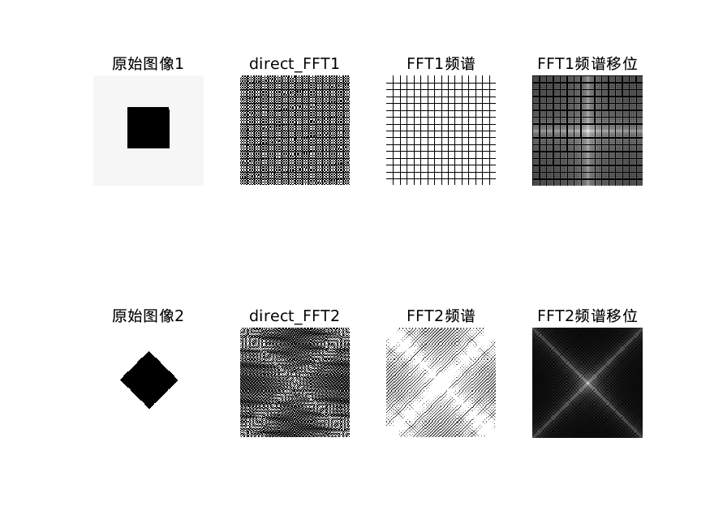
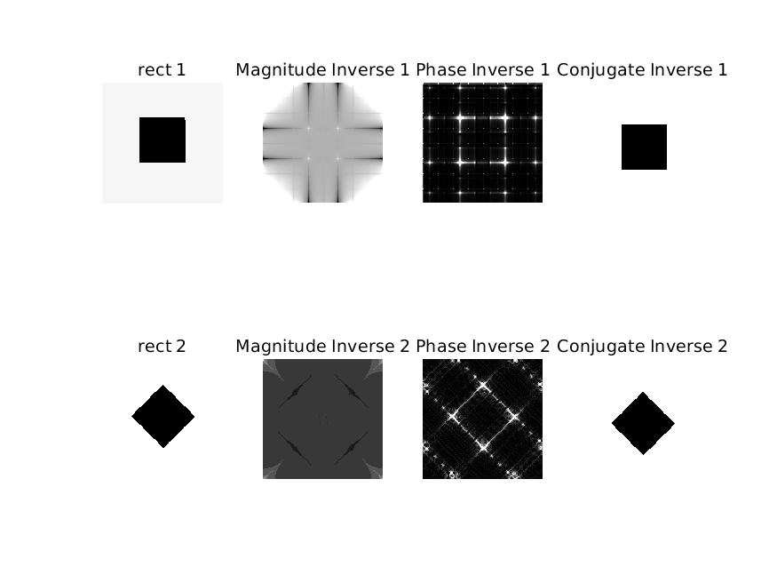
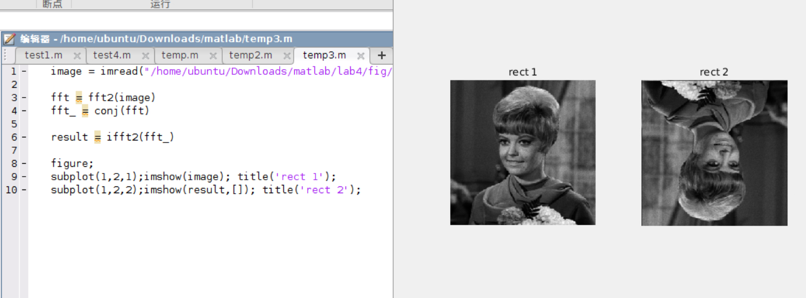
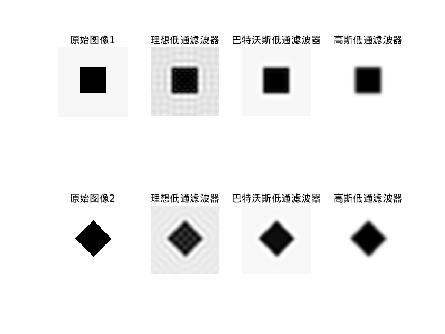
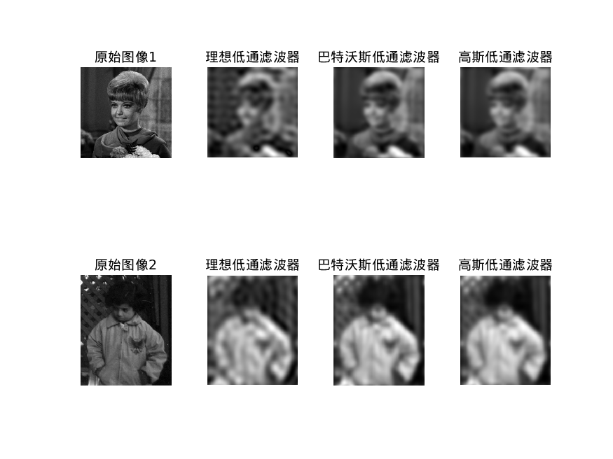
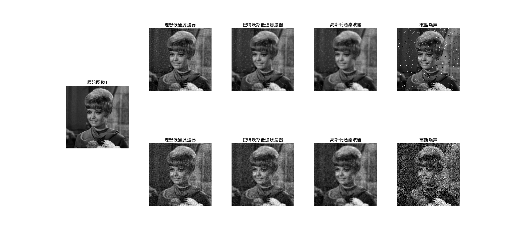
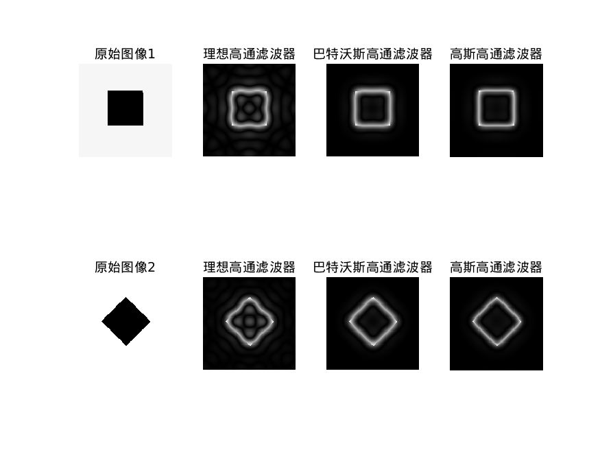
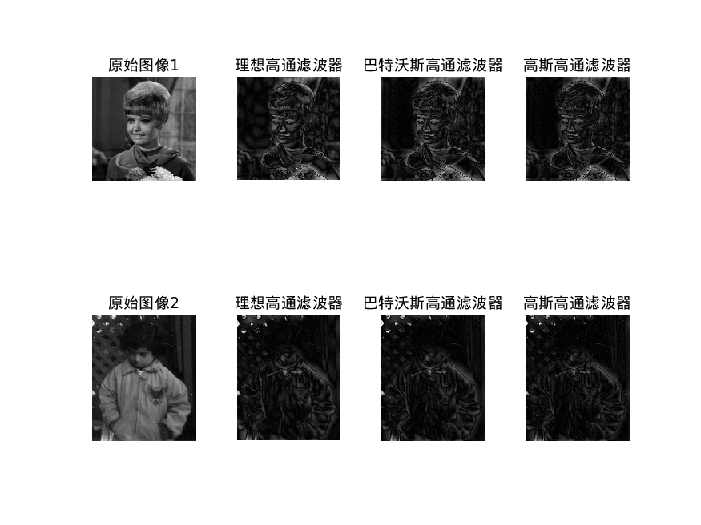
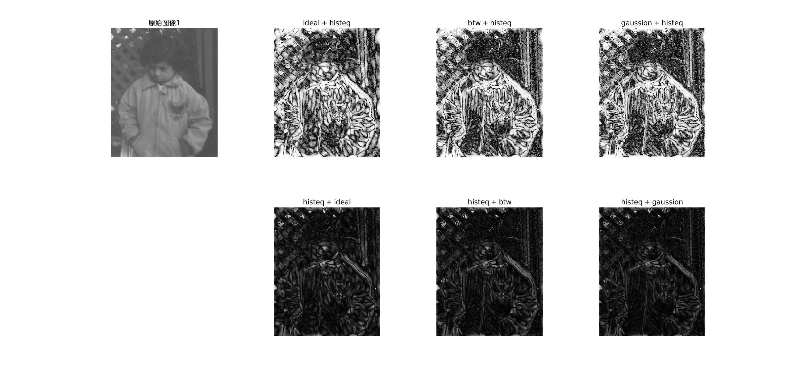

# 数字图像处理与分析 Lab3

**PB22111665 胡揚嘉**

## 实验目的

本次实验主要是通过matlab实现有关频率域特征和处理，频率域滤波的问题

掌握Fourier变换、反变换的算法实现，并验证Fourier变换的性质，初步理解Fourier变换的物理意义。掌握频域空间的各种滤波器。

具体而言包括：

+ 均值滤波和超限邻域平均法
+ 用Fourier变换算法对图像作二维Fourier变换。
+ 用Fourier反变换算法对图像作二维Fourier反变换。
+ 评价人眼对图像幅度特性和相位特性的敏感度。
+ 设计频域平滑滤波器，对图像进行滤波。
+ 设计频域锐化滤波器，对图像进行滤波。

## 实验内容

### Lab1 研究傅里叶变化的频率图像相关

#### 代码和分析

```matlab
image1 = imread("/home/ubuntu/Downloads/matlab/lab4/fig/Rect1.bmp");
image2 = imread("/home/ubuntu/Downloads/matlab/lab4/fig/Rect2.bmp");

% 初步FFT2
fft_1 = fft2(image1);
fft_2 = fft2(image2);

% 获得频谱
fft_1_fre = abs(fft_1);
fft_2_fre = abs(fft_2);

% 对幅度做变换
fft_1_shift = log(abs(fftshift(fft_1))+1);
fft_2_shift = log(abs(fftshift(fft_2))+1);


% 查阅发现，变换后，范围不在于0-255，所以添加[]参数
subplot(2, 4, 1); imshow(image1); title('原始图像1');
subplot(2, 4, 2); imshow(real(fft_1)) ; title('direct\_FFT1');
subplot(2, 4, 3); imshow(fft_1_fre); title('FFT1频谱');
subplot(2, 4, 4); imshow(fft_1_shift, []); title('FFT1频谱移位');

subplot(2, 4, 5); imshow(image2, []); title('原始图像2');
subplot(2, 4, 6); imshow(real(fft_2)) ; title('direct\_FFT2');
subplot(2, 4, 7); imshow(fft_2_fre); title('FFT2频谱');
subplot(2, 4, 8); imshow(fft_2_shift, []); title('FFT2频谱移位');

% 保存
filename = '/home/ubuntu/Downloads/matlab/lab4/fig/';
saveas(gcf, [filename 'FFT.png']);
```

分析：

1. 对于每个图像，傅里叶变换后的实部图像，频谱图象，频谱位移并且通过`log`函数展示的图像

1. 对多个图像进行对比，观察其关系和内在联系和不同

3. 对于图像展示，查询发现，对于 `uint8` 类型而言，展示范围只有`[0,255]`，超出部分会被截取。

   而傅里叶变换会导致生成的频谱系数常常超过这个范围。

   所以这里使用`[]`来进行放缩，并且使用`log`来避免极端值导致大部分区域极为接近0或者255.


#### 实现结果



如图所示，子啊经过频谱位移，`log`放缩和`[]`参数调节后，我们获得了常见的频谱图像。

### Lab2 多种反变化

#### 代码和分析

```matlab
image1 = imread("/home/ubuntu/Downloads/matlab/lab4/fig/Rect1.bmp");
image2 = imread("/home/ubuntu/Downloads/matlab/lab4/fig/Rect2.bmp");

% 三个反变换

fft_1 = fft2(image1);
fft_2 = fft2(image2);

% 幅度反变换
IF1_abs = uint8(ifft2(abs(fft_1)));
IF2_abs = uint8(ifft2(abs(fft_2)));

% 相位反变换
m = 10000; % 乘以一个常数,实验发现，不然太小了
phase1 = angle(fft_1);
phase2 = angle(fft_2);
IF1_angle = uint8(abs(ifft2(m*exp(1i*phase1))));
IF2_angle = uint8(abs(ifft2(m*exp(1i*phase2))));

% 共轭反变换
conjF1 = conj(fft_1);
conjF2 = conj(fft_2);
IF1_conj = ifft2(conjF1);
IF2_conj = ifft2(conjF2);

subplot(2, 4, 1); imshow(image1); title('rect 1');
subplot(2, 4, 2); imshow(IF1_abs); title('Magnitude Inverse 1');
subplot(2, 4, 3); imshow(IF1_angle); title('Phase Inverse 1');
subplot(2, 4, 4); imshow(IF1_conj); title('Conjugate Inverse 1');

subplot(2, 4, 5); imshow(image2, []); title('rect 2');
subplot(2, 4, 6); imshow(IF2_abs, []); title('Magnitude Inverse 2');
subplot(2, 4, 7); imshow(IF2_angle); title('Phase Inverse 2');
subplot(2, 4, 8); imshow(IF2_conj, []); title('Conjugate Inverse 2');

% 保存
filename = '/home/ubuntu/Downloads/matlab/lab4/fig/';
saveas(gcf, [filename 'reverse.png']);
```

分析：

1. 将对于每幅图像，分别进行了

   + 幅度反变化
   + 相位反变化
   + 共轭反变化

   三种反变化的特点是：

   + **幅度反变化**：这种操作主要影响图像的低频成分，使得图像的整体亮度发生变化。具体来说，通过反转图像的幅度信息，可以观察到图像在低频部分的显著变化，而高频细节则相对保持不变。这种处理方式有助于分析图像中的整体结构和背景信息。
   + **相位反变化**：相位信息的反转主要影响图像的高频成分，导致图像的边缘和细节部分发生明显的变化。由于人眼对相位信息较为敏感，因此相位反变化会显著改变图像的视觉效果，使得原本清晰的边缘变得模糊或产生伪影。这种处理方式有助于研究相位信息在图像感知中的作用。
   + **共轭反变化**：共轭反变化是指同时反转图像的幅度信息和相位信息。这种操作会导致图像的所有频率成分都发生显著变化，从而彻底改变图像的外观。共轭反变化不仅会影响图像的整体亮度和结构，还会使边缘和细节部分产生明显的失真。这种处理方式有助于全面了解幅度和相位信息对图像的综合影响。
2. 在实现上：

   + 相位反变化会丢失幅度信息，导致生成的图像亮度极低，所以这里通过多次测试，选取`m = 10000; `常数进行亮度提高


#### 实现结果



可以观察得到：

1. 共轭反变化，前后的视觉效果几乎不变。但是这是由于图像本身是中心对称的原因，下面给出一个不对称的图像的共轭反变化的例子

   

2. 幅度反变化和相位反变化，都有是真现象。


### Lab3 低通滤波器

#### 代码和分析

```matlab
% 读取图像
% image1 = imread("/home/ubuntu/Downloads/matlab/lab4/fig/Girl.bmp");
% image2 = imread("/home/ubuntu/Downloads/matlab/lab4/fig/pout.bmp");
% 实验发现，使用Rect1,2更容易识别振铃现象
image1 = imread("/home/ubuntu/Downloads/matlab/lab4/fig/Rect1.bmp");
image2 = imread("/home/ubuntu/Downloads/matlab/lab4/fig/Rect2.bmp");

% rect1
M = size(image1, 1);
N = size(image1, 2);
D0 = 10;
% 设计滤波器
ideal = get_filter(1, M, N, D0, 2, 0);
btw = get_filter(2, M, N, D0, 2, 0);
gaussion = get_filter(3, M, N, D0, 2, 0);
% 进行滤波
output_1_ideal = freqfilter(image1, ideal);
output_1_btw = freqfilter(image1, btw);
output_1_gaussion = freqfilter(image1, gaussion);

% rect2
M = size(image2, 1);
N = size(image2, 2);
% D0 = 10;
% 设计滤波器
ideal = get_filter(1, M, N, D0, 2, 0);
btw = get_filter(2, M, N, D0, 2, 0);
gaussion = get_filter(3, M, N, D0, 2, 0);
% 进行滤波
output_2_ideal = freqfilter(image2, ideal);
output_2_btw = freqfilter(image2, btw);
output_2_gaussion = freqfilter(image2, gaussion);

% 显示结果
figure;
subplot(2, 4, 1); imshow(image1); title('原始图像1');
subplot(2, 4, 2); imshow(output_1_ideal, []); title('理想低通滤波器');
subplot(2, 4, 3); imshow(output_1_btw, []); title('巴特沃斯低通滤波器');
subplot(2, 4, 4); imshow(output_1_gaussion, []); title('高斯低通滤波器');
subplot(2, 4, 5); imshow(image2, []); title('原始图像2');
subplot(2, 4, 6); imshow(output_2_ideal, []); title('理想低通滤波器');
subplot(2, 4, 7); imshow(output_2_btw, []); title('巴特沃斯低通滤波器');
subplot(2, 4, 8); imshow(output_2_gaussion, []); title('高斯低通滤波器');

% 保存
filename = '/home/ubuntu/Downloads/matlab/lab4/fig/';
saveas(gcf, [filename 'test3.png']);


function H = get_filter(type, M, N, D0, n, check)
    % 为M*N大小的图像生成一个滤波器
    % type: 滤波器类型
    % 1- idea
    % 2- Butterworth
    % 3- Gaussian
    % D0: 截止频率
    % n: 指数/阶数
    % check: 是否显示滤波器，用于展示
    [U,V] = meshgrid(-N/2:N/2-1,-M/2:M/2-1); %构建坐标,默认已经将频域的中心移到矩阵的中心
    D = hypot(U,V);%计算中心偏移距离
    
    % Generate filter based on type
    switch type
        case 1
            H = D <= D0;
        case 2
            if n == 0
                error('The order of Butterworth filter cannot be 0.');
            end
            H = 1./(1 + (D./D0).^(2*n));
        case 3
            H = exp(-(D./D0).^n);
        otherwise
            error('Unsupported filter type.');
    end
    
    if check
        % Normalize filter to range [0, 1]
        H = H / max(H(:));
        % Create a 2D filter
        % H = H .* (H > 0.01); % Apply threshold to filter
        % Display filter if check is true
        figure;
        imshow(H, []);
        title(['Filter Type: ', num2str(type)]);
        colormap(gray);
        colorbar;
    end
    % return H;
end

function output = freqfilter(img, H)
    % 傅里叶变换并且将频谱移到中心
    F = fft2(img);
    F = fftshift(F);
    
    % 对每一个点进行滤波检查操作，等价于执行get_filter函数对对应点规定的函数
    G = F .* H;
    
    % 将频谱移回原点并且进行反傅里叶变换
    G = ifftshift(G);
    output = abs(ifft2(G));
end
```

分析：

1. 这里构造了自己的函数
   ```matlab
   function H = get_filter(type, M, N, D0, n, check)
       % 为M*N大小的图像生成一个滤波器
       % type: 滤波器类型
       % 1- idea
       % 2- Butterworth
       % 3- Gaussian
       % D0: 截止频率
       % n: 指数/阶数
       % check: 是否显示滤波器，用于展示
       [U,V] = meshgrid(-N/2:N/2-1,-M/2:M/2-1); %构建坐标,默认已经将频域的中心移到矩阵的中心
       D = hypot(U,V);%计算中心偏移距离
       
       % Generate filter based on type
       switch type
           case 1
               H = D <= D0;
           case 2
               if n == 0
                   error('The order of Butterworth filter cannot be 0.');
               end
               H = 1./(1 + (D./D0).^(2*n));
           case 3
               H = exp(-(D./D0).^n);
           otherwise
               error('Unsupported filter type.');
       end
   
   end
   ```
   1. 这里希望生成一个滤波器，其基于一个[M,N]的原始图像，对不同的滤波器进行处理，给出对应的滤波器，用于后面的滤波操作
      - **频域坐标构建:** `meshgrid` 函数生成两个矩阵 `U` 和 `V`，它们分别表示频域中每个点在水平（行）和垂直（列）方向上的坐标偏移。坐标范围从 `-[N/2, M/2]` 到 `[N/2-1, M/2-1]`，这确保了频域的中心位于矩阵的几何中心，符合傅里叶变换后通常将低频移至中心的习惯。
      - **距离计算:** `hypot(U, V)` 计算每个频域点到中心点的欧几里得距离 `D`。矩阵 `D` 中的每个元素 `D(u,v)` 代表了频域点 `(u,v)` 到中心的距离。

```matlab
function output = freqfilter(img, H)
    % 傅里叶变换并且将频谱移到中心
    F = fft2(img);
    F = fftshift(F);
    
    % 对每一个点进行滤波检查操作，等价于执行get_filter函数对对应点规定的函数
    G = F .* H;
    
    % 将频谱移回原点并且进行反傅里叶变换
    G = ifftshift(G);
    output = abs(ifft2(G));
end
```

1. 这里是利用上方函数形成的滤波器，进行**频率域**的滤波操作

   将原始图像进行傅里叶变换，并且低频信号平移到图像中心

   对每一个点，按照滤波器的操作，进行对应的变化

   然后进行傅里叶反变化的一系列操作


+ 巴特沃斯和高斯低通的指数/阶数都选择了2进行实验

#### 实现结果



1. 我在实验时，意外先使用`rect1,rect2`图像进行实验，在理想低通中发现了明显的振铃现象，如上图所示。
2. 由于滤波器的选择或图像复原过程中高频信息的丢失，导致输出图像在灰度剧烈变化处产生的震荡现象。这种现象类似于钟被敲击后产生的空气震荡

   而对比巴特沃斯和高斯低通，由于其截取更加平滑，导致没有明显振铃现象。

下面是要求的图像的结果



如图所示，有振铃效果，但是不明显，分析同上，

### Lab4 低通滤波除噪实验

#### 代码和分析

```matlab
% 读取图像
image1 = imread("/home/ubuntu/Downloads/matlab/lab4/fig/Girl.bmp");

% 添加椒盐噪声
image11 = imnoise(image1, 'salt & pepper', 0.03);

% 添加高斯噪声 , mu=0, sigma=0.1
image12 = imnoise(image1, 'gaussian', 0, 0.03); 

% rect1
M = size(image1, 1);
N = size(image1, 2);
D0 = 40;
% 设计滤波器
ideal = get_filter(1, M, N, D0, 2, 0);
btw = get_filter(2, M, N, D0, 2, 0);
gaussion = get_filter(3, M, N, D0, 2, 0);

% 进行滤波，椒盐噪声
output_1_ideal = freqfilter(image11, ideal);
output_1_btw = freqfilter(image11, btw);
output_1_gaussion = freqfilter(image11, gaussion);
% 进行滤波，高斯噪声
output_2_ideal = freqfilter(image12, ideal);
output_2_btw = freqfilter(image12, btw);
output_2_gaussion = freqfilter(image12, gaussion);

% 显示结果
figure;
subplot(2, 5, [1,6]); imshow(image1); title('原始图像1');

subplot(2, 5, 2); imshow(output_1_ideal, []); title('理想低通滤波器');
subplot(2, 5, 3); imshow(output_1_btw, []); title('巴特沃斯低通滤波器');
subplot(2, 5, 4); imshow(output_1_gaussion, []); title('高斯低通滤波器');
subplot(2, 5, 5); imshow(image11, []); title('椒盐噪声');

subplot(2, 5, 7); imshow(output_2_ideal, []); title('理想低通滤波器');
subplot(2, 5, 8); imshow(output_2_btw, []); title('巴特沃斯低通滤波器');
subplot(2, 5, 9); imshow(output_2_gaussion, []); title('高斯低通滤波器');
subplot(2, 5, 10); imshow(image12, []); title('高斯噪声');


set(gcf, 'Position', get(0,'Screensize')); % 使图形窗口最大化
% 保存
filename = '/home/ubuntu/Downloads/matlab/lab4/fig/';
saveas(gcf, [filename 'test4.png']);


function H = get_filter(type, M, N, D0, n, check)
    % 为M*N大小的图像生成一个滤波器
    % type: 滤波器类型
    % 1- idea
    % 2- Butterworth
    % 3- Gaussian
    % D0: 截止频率
    % n: 指数/阶数
    % check: 是否显示滤波器，用于展示
    [U,V] = meshgrid(-N/2:N/2-1,-M/2:M/2-1); %构建坐标,默认已经将频域的中心移到矩阵的中心
    D = hypot(U,V);%计算中心偏移距离
    
    % Generate filter based on type
    switch type
        case 1
            H = D <= D0;
        case 2
            if n == 0
                error('The order of Butterworth filter cannot be 0.');
            end
            H = 1./(1 + (D./D0).^(2*n));
        case 3
            H = exp(-(D./D0).^n);
        otherwise
            error('Unsupported filter type.');
    end
    
    if check
        % Normalize filter to range [0, 1]
        H = H / max(H(:));
        % Create a 2D filter
        % H = H .* (H > 0.01); % Apply threshold to filter
        % Display filter if check is true
        figure;
        imshow(H, []);
        title(['Filter Type: ', num2str(type)]);
        colormap(gray);
        colorbar;
    end
    % return H;
end

function output = freqfilter(img, H)
    % 傅里叶变换并且将频谱移到中心
    F = fft2(img);
    F = fftshift(F);
    
    % 对每一个点进行滤波检查操作，等价于执行get_filter函数对对应点规定的函数
    G = F .* H;
    
    % 将频谱移回原点并且进行反傅里叶变换
    G = ifftshift(G);
    output = abs(ifft2(G));
end
```


分析：

1. 函数和上题目的完全一致，不做单独讲解
2. 对于噪声：
   + 设置 `mu=0, sigma=0.1`的高斯噪声
   + 设置 `0.03` 的椒盐噪声


#### 实现结果



1. | 低通滤波器         | 椒盐噪声去除效果     | 高斯噪声去除效果     |
   | :----------------- | :------------------- | :------------------- |
   | 理想低通滤波器     | 一般，可能有振铃效应 | 一般，振铃效应明显   |
   | 巴特沃斯低通滤波器 | 较好，较少振铃效应   | 较好，较少振铃效应   |
   | 高斯低通滤波器     | 很好，几乎无振铃效应 | 很好，几乎无振铃效应 |

2. 综上所述，高斯低通滤波器在两种噪声条件下均表现出色，既能有效去除噪声又能较好地保护图像细节。巴特沃斯低通滤波器次之，而理想低通滤波器虽然能有效去噪，但容易引入振铃效应，影响图像质量。在实际应用中，应根据具体情况选择合适的滤波器以达到最佳的去噪效果。


### Lab5 高通滤波

#### 代码和分析

```matlab
% 读取图像
% image1 = imread("/home/ubuntu/Downloads/matlab/lab4/fig/Girl.bmp");
% image2 = imread("/home/ubuntu/Downloads/matlab/lab4/fig/pout.bmp");
% 实验发现，使用Rect1,2更容易识别振铃现象
image1 = imread("/home/ubuntu/Downloads/matlab/lab4/fig/Rect1.bmp");
image2 = imread("/home/ubuntu/Downloads/matlab/lab4/fig/Rect2.bmp");

% rect1
M = size(image1, 1);
N = size(image1, 2);
D0 = 5;
% 设计滤波器
ideal = get_filter(1, M, N, D0, 2, 0);
btw = get_filter(2, M, N, D0, 2, 0);
gaussion = get_filter(3, M, N, D0, 2, 0);
% 进行滤波
output_1_ideal = freqfilter(image1, ideal);
output_1_btw = freqfilter(image1, btw);
output_1_gaussion = freqfilter(image1, gaussion);

% rect2
M = size(image2, 1);
N = size(image2, 2);
% D0 = 10;
% 设计滤波器
ideal = get_filter(1, M, N, D0, 2, 0);
btw = get_filter(2, M, N, D0, 2, 0);
gaussion = get_filter(3, M, N, D0, 2, 0);
% 进行滤波
output_2_ideal = freqfilter(image2, ideal);
output_2_btw = freqfilter(image2, btw);
output_2_gaussion = freqfilter(image2, gaussion);

% 显示结果
figure;
subplot(2, 4, 1); imshow(image1); title('原始图像1');
subplot(2, 4, 2); imshow(output_1_ideal, []); title('理想高通滤波器');
subplot(2, 4, 3); imshow(output_1_btw, []); title('巴特沃斯高通滤波器');
subplot(2, 4, 4); imshow(output_1_gaussion, []); title('高斯高通滤波器');
subplot(2, 4, 5); imshow(image2, []); title('原始图像2');
subplot(2, 4, 6); imshow(output_2_ideal, []); title('理想高通滤波器');
subplot(2, 4, 7); imshow(output_2_btw, []); title('巴特沃斯高通滤波器');
subplot(2, 4, 8); imshow(output_2_gaussion, []); title('高斯高通滤波器');

% 保存
filename = '/home/ubuntu/Downloads/matlab/lab4/fig/';
saveas(gcf, [filename 'test5.png']);


function H = get_filter(type, M, N, D0, n, check)
    % 为M*N大小的图像生成一个滤波器
    % type: 滤波器类型
    % 1- idea
    % 2- Butterworth
    % 3- Gaussian
    % D0: 截止频率
    % n: 指数/阶数
    % check: 是否显示滤波器，用于展示
    [U,V] = meshgrid(-N/2:N/2-1,-M/2:M/2-1); %构建坐标,默认已经将频域的中心移到矩阵的中心
    D = hypot(U,V);%计算中心偏移距离
    
    % Generate filter based on type
    switch type
        case 1
            H = D > D0;
        case 2
            if n == 0
                error('The order of Butterworth filter cannot be 0.');
            end
            H = 1./(1 + (D0./D).^(2*n));
        case 3
            H = exp(-(D0./D).^n);
        otherwise
            error('Unsupported filter type.');
    end
    
    if check
        % Normalize filter to range [0, 1]
        H = H / max(H(:));
        % Create a 2D filter
        % H = H .* (H > 0.01); % Apply threshold to filter
        % Display filter if check is true
        figure;
        imshow(H, []);
        title(['Filter Type: ', num2str(type)]);
        colormap(gray);
        colorbar;
    end
    % return H;
end

function output = freqfilter(img, H)
    % 傅里叶变换并且将频谱移到中心
    F = fft2(img);
    F = fftshift(F);
    
    % 对每一个点进行滤波检查操作，等价于执行get_filter函数对对应点规定的函数
    G = F .* H;
    
    % 将频谱移回原点并且进行反傅里叶变换
    G = ifftshift(G);
    output = abs(ifft2(G));
end
```

分析：

1. 思路同低通滤波一样

   唯一的区别在于自己的函数定制的滤波器的特征，如何构成

   ```matlab
   	switch type
           case 1
               H = D > D0;
           case 2
               if n == 0
                   error('The order of Butterworth filter cannot be 0.');
               end
               H = 1./(1 + (D0./D).^(2*n));
           case 3
               H = exp(-(D0./D).^n);
           otherwise
               error('Unsupported filter type.');
       end
   ```

   做一点稍许改动，即可生成高通滤波器


#### 实现结果



1. 同样的，由于高通滤波和低通滤波互为补，所以视觉上可见，理想高通的振铃现象相当明显。

下面是要求的图像




### Lab6 处理顺序对结果的影响

#### 代码和分析

```matlab
% 读取图像
image1 = imread("/home/ubuntu/Downloads/matlab/lab4/fig/pout.bmp");


% rect1
M = size(image1, 1);
N = size(image1, 2);
D0 = 10;
% 设计滤波器
ideal = get_filter(1, M, N, D0, 2, 0);
btw = get_filter(2, M, N, D0, 2, 0);
gaussion = get_filter(3, M, N, D0, 2, 0);

% 进行高通滤波
output_1_ideal = freqfilter(image1, ideal);
output_1_btw = freqfilter(image1, btw);
output_1_gaussion = freqfilter(image1, gaussion);

% 直方图均衡化
output1 = histeq((uint8(output_1_ideal)));
output2 = histeq((uint8(output_1_btw)));
output3 = histeq((uint8(output_1_gaussion)));

% 先直方图均衡化
image12 = histeq(image1);

% 进行滤波，高斯噪声
output_2_ideal = freqfilter(image12, ideal);
output_2_btw = freqfilter(image12, btw);
output_2_gaussion = freqfilter(image12, gaussion);

% 显示结果
figure;
subplot(2, 4, 1); imshow(image1); title('原始图像1');
subplot(2, 4, 2); imshow(output1, []); title('ideal + histeq');
subplot(2, 4, 3); imshow(output2, []); title('btw + histeq');
subplot(2, 4, 4); imshow(output3, []); title('gaussion + histeq');
% subplot(2, 4, 5); imshow(image12, []); title('');
subplot(2, 4, 6); imshow(output_2_ideal, []); title('histeq + ideal');
subplot(2, 4, 7); imshow(output_2_btw, []); title('histeq + btw');
subplot(2, 4, 8); imshow(output_2_gaussion, []); title('histeq + gaussion');


set(gcf, 'Position', get(0,'Screensize')); % 使图形窗口最大化
% 保存
filename = '/home/ubuntu/Downloads/matlab/lab4/fig/';
saveas(gcf, [filename 'test6.png']);


function H = get_filter(type, M, N, D0, n, check)
    % 为M*N大小的图像生成一个滤波器
    % type: 滤波器类型
    % 1- idea
    % 2- Butterworth
    % 3- Gaussian
    % D0: 截止频率
    % n: 指数/阶数
    % check: 是否显示滤波器，用于展示
    [U,V] = meshgrid(-N/2:N/2-1,-M/2:M/2-1); %构建坐标,默认已经将频域的中心移到矩阵的中心
    D = hypot(U,V);%计算中心偏移距离
    
    % Generate filter based on type
    switch type
        case 1
            H = D > D0;
        case 2
            if n == 0
                error('The order of Butterworth filter cannot be 0.');
            end
            H = 1./(1 + (D0./D).^(2*n));
        case 3
            H = exp(-(D0./D).^n);
        otherwise
            error('Unsupported filter type.');
    end
    
    if check
        % Normalize filter to range [0, 1]
        H = H / max(H(:));
        % Create a 2D filter
        % H = H .* (H > 0.01); % Apply threshold to filter
        % Display filter if check is true
        figure;
        imshow(H, []);
        title(['Filter Type: ', num2str(type)]);
        colormap(gray);
        colorbar;
    end
    % return H;
end

function output = freqfilter(img, H)
    % 傅里叶变换并且将频谱移到中心
    F = fft2(img);
    F = fftshift(F);
    
    % 对每一个点进行滤波检查操作，等价于执行get_filter函数对对应点规定的函数
    G = F .* H;
    
    % 将频谱移回原点并且进行反傅里叶变换
    G = ifftshift(G);
    output = abs(ifft2(G));
end
```

分析：

1. 代码层面，高通滤波器设计不变，直方图均衡化直接调用`histeq`函数实现

#### 实现结果



分析：

1. 直方图均衡化可以平衡图像灰度的分布特征，使得视觉上亮度适中，图片更清晰

   1. 先直方图均衡化，在高通：

      由于高通和滤波过滤低频信息，导致直方图均衡化后的图像的灰度分布被破坏，图像又变得灰暗
   2. 先高通，在直方图均衡化：

      最后进行直方图均衡化，灰度分布均匀，效果显著，很清晰

2. 猜想：无论如何处置，如果希望最后视觉上清晰，最后一步应该必须是直方图均衡化为好。

## 实验总结

1. 本次实验主要是通过matlab实现有关 `频率域处理和观察，频率域滤波`的问题。使用各种matlab提供的库函数实现相应功能。
1. 通过本次实验，掌握了傅里叶变换和傅里叶反变换相关的操作和操作特点，在频率域的滤波器设计和处理，加深了对操作的把握。最后研究操作顺序对结果的影响，发现了其特点。
