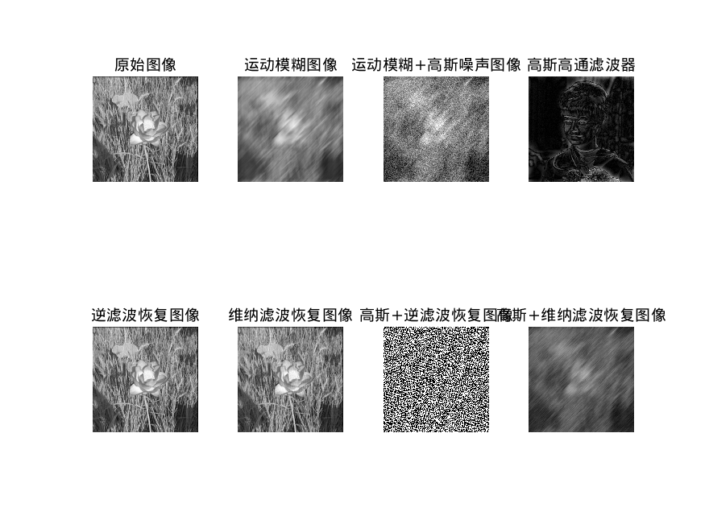

# 数字图像处理与分析 Lab5

**PB22111665 胡揚嘉**

## 实验目的

本次实验主要是通过matlab实现图像切割与恢复的内容

1. 掌握常见的图像退化模型，包括运动模糊、高斯噪声等，以及利用逆滤波和维纳滤波来消除这些退化现象的方法。

具体而言包括：

+ 使用逆滤波和维纳滤波对产生的运动模糊图像进行恢复。
+ 采用大津法（OTSU）自动选取阈值进行分割，显示分割二值化结果图像。
+ 采用四叉树表达的迭代区域分裂合并算法进行分割，显示分割结果图像。

## 实验内容

### Lab1 图像模糊与处理

#### 代码和分析

```matlab

image = imread("/home/ubuntu/Downloads/matlab/lab5/fig/flower1.jpg");

image_double = im2double(image);

% 运动模糊
angle = 45; % 运动方向
len = 30; % 运动位移
h = fspecial('motion', len, angle); % 运动模糊滤波器
% blurred_image = imfilter(image_double, h, 'conv', 'circular'); % 运动模糊图像
blurred_image = imfilter(image_double, h, 'conv'); % 运动模糊图像
% blurred_image = imfilter(image_double, h, 'conv', 'replicate'); % 运动模糊图像
% blurred_image = imfilter(image_double, h, 'conv', 'symmetric'); % 运动模糊图像
% hint: 发现只有 'circular' 方式能得到较好的效果
% 搜索明白，采用的滤波手段对频率成分敏感，而其他参数会引入非周期性的错误频率，极大影响滤波效果

% 加高斯噪声
noise = imnoise(blurred_image, 'gaussian', 0, 0.01); % 高斯噪声

% 修复
% 逆滤波
result_inverse_1 = deconvwnr(blurred_image, h); % 逆滤波
result_inverse_2 = deconvwnr(noise, h); % 逆滤波

% 维纳滤波
% 需要信噪比的倒数，对于没有高斯噪声的情况，设置一个超小值
result_wiener_1 = deconvwnr(blurred_image, h, 0.0001); % 维纳滤波
num =  var(noise(:)) / 0.01; % 计算信噪比
result_wiener_2 = deconvwnr(noise, h, 1/num); % 维纳滤波


subplot(2, 4, 1); imshow(image_double); title('原始图像');
subplot(2, 4, 2); imshow(blurred_image); title('运动模糊图像');
subplot(2, 4, 3); imshow(noise); title('运动模糊+高斯噪声图像');

subplot(2, 4, 5); imshow(result_inverse_1); title('逆滤波恢复图像');
subplot(2, 4, 6); imshow(result_wiener_1); title('维纳滤波恢复图像');
subplot(2, 4, 7); imshow(result_inverse_2); title('高斯+逆滤波恢复图像');
subplot(2, 4, 8); imshow(result_wiener_2); title('高斯+维纳滤波恢复图像');

% 保存
filename = '/home/ubuntu/Downloads/matlab/lab5/fig/';
saveas(gcf, [filename 'temp1.png']);
```

分析：

1. 使用卷积的方式，对图像进行模糊操作。然后再模糊的基础上，增加高斯噪音备用

1. 对于每种图像，分别使用逆滤波和维纳滤波进行处理


#### 实现结果


分析：

1. 这样会发现，恢复效果极差，经过多次实验和查询资料，发现问题出现在代码`blurred_image = imfilter(image_double, h, 'conv'); % 运动模糊图像`的参数上
   + 采用的滤波手段对频率成分敏感，而使用除`circular`外**所有的**参数会引入非周期性的**错误频率**，极大影响滤波效果
   + 例如，不加参数，增加一圈为0的空白像素，相当于再边缘增加一层奇怪的高频信号
   + 最后使用`% blurred_image = imfilter(image_double, h, 'conv', 'circular'); % 运动模糊图像`解决问题，这样采用本身的图像，恰好频率域下不影响

下面是基于上面分析，更好的处理结果



分析：

1. 同样如上面所说，增加高斯噪声后，逆滤波由于对频率域敏感，高斯噪声导致回复效果极差，维纳滤波稍好一点
2. 对没有高斯噪声的滤波，效果非常好，恢复程度很高


### Lab2 大津法二值分割

#### 代码和分析

```matlab
lena = (imread("/home/ubuntu/Downloads/matlab/lab5/fig/lena.bmp"));
[m, n] = size(lena);


% graythresh 函数使用大津法（OTSU）自动计算图像的阈值。
% T 是一个标量，表示计算得到的阈值，范围在0到1之间。用于imbinarize的二值分割
T = graythresh(lena);
lena_2 = imbinarize(lena, T);

count = tabulate(lena(:));
total = m * n;

% 选择237的原因是，最大为238，否则会超出count的范围，导致报错，这是实验出来的

max = 0;
for i = 2 : 237
    n0 = sum(count(1:i - 1, 2));
    w0 = n0 / total;
    n1 = sum(count(i + 1:238, 2));
    w1 = n1 / total;
    % u0,u1计算灰度均值
    if (n0 == 0)
        u0 = 0;
    else
        u0 = sum(count(1:i-1, 2) .* count(1:i-1, 1)) / n0;
    end
    if (n1 == 0)
        u1 = 0;
    else
        u1 = sum(count(i+1:238, 2) .* count(i+1:238, 1)) / n1;
    end
    
    g = w0 * w1 * (u0 - u1)^2;
    if g > max
        max = g;
        maxT = i;
    end
end

lena_3 = imbinarize(lena, maxT/256);

figure();
subplot(1, 3, 1);
imshow(lena);
title("Lena 原始图");

subplot(1, 3, 2);
imshow(lena_2, []);
title("Lena 二值分割图（调用函数实现）");

subplot(1, 3, 3);
imshow(lena_3, []);
title("Lena 二值分割图（自己实现）");


filename = '/home/ubuntu/Downloads/matlab/lab5/fig/';
saveas(gcf, [filename 'temp2.png']);
```

分析：

1. 分别自己实现和调用函数实现

   `T = graythresh(lena);`直接得到大津法下的阈值T
   
   ```matlab
   count = tabulate(lena(:));
   total = m * n;
   
   % 选择237的原因是，最大为238，否则会超出count的范围，导致报错，这是实验出来的
   
   max = 0;
   for i = 2 : 237
       n0 = sum(count(1:i - 1, 2));
       w0 = n0 / total;
       n1 = sum(count(i + 1:238, 2));
       w1 = n1 / total;
       % u0,u1计算灰度均值
       if (n0 == 0)
           u0 = 0;
       else
           u0 = sum(count(1:i-1, 2) .* count(1:i-1, 1)) / n0;
       end
       if (n1 == 0)
           u1 = 0;
       else
           u1 = sum(count(i+1:238, 2) .* count(i+1:238, 1)) / n1;
       end
       
       g = w0 * w1 * (u0 - u1)^2;
       if g > max
           max = g;
           maxT = i;
       end
   end
   
   ```
   
   按照PPT的法则，逐个灰度测试，找到最大的值对于的灰度
   
   特别注意的是，count会有一个最大值和最小值，所以for的范围是根据这个确定的


#### 实现结果


可以观察得到：

1. 自己分割和调用函数效果完全相同


### Lab3 四叉树表达的迭代区域分裂合并算法

#### 代码和分析

```matlab
% 对图像 cameraman.bmp 采用四叉树表达的迭代区域分裂合并算法进行分割。显示分割结果图像。

image = imread('/home/ubuntu/Downloads/matlab/lab5/fig/cameraman.bmp');

% 调用 qtdecomp() 函数对图像进行四叉树分割，并将分割后的结果保存在数组 S 中。
% value_range 参数控制分割的粒度，值越大分割越细。此处设置为 0.35。
value_range = 0.5;
S = qtdecomp(image,value_range,2);%四叉树分割
blocks = zeros(256);

% 通过循环遍历不同的分块大小，产生分块边界。
% 对于每个分块，将其边界像素设置为白色，其余像素设置为黑色，并将其保存在 256x256 的数组 blocks 中。
for dim = [64 32 16 8 4 2]
	blocks_cnt = length(find(S==dim));    
	if (blocks_cnt > 0)        
        % 全部设置为黑色
        values = repmat(uint8(1),[dim dim blocks_cnt]);
        % 设置边界为白色
        values(2:dim,2:dim,:) = 0;
        % 将分块保存在 blocks 中
        blocks = qtsetblk(blocks,S,dim,values);
  end
end

%产生分裂图
output1 = image;

output1(blocks==1) = 255;

% 在分块边界的基础上，将每个分块进行标记，用不同的整数表示。标记后的结果保存在数组 blocks 中。
i = 0;
for dim = [64 32 16 8 4 2]
    % 从分块中提取块
    [vals,r,c] = qtgetblk(image,S,dim);
    % 如果块不为空，则对块进行标记
    if ~isempty(vals)
        for j = 1:length(r)
            i = i + 1;
            blocks(r(j):r(j)+ dim - 1,c(j):c(j)+ dim - 1) = i;
        end
    end
end

% 对于极差较小的分块，将其与周围的分块合并。
% 具体做法是对于每个分块，找到其周围边界像素，并将其与当前分块合并，计算合并后分块的极差，
% 如果小于预设的值 value_range*256，则将其标记与当前分块相同。
for j = 1 : i
    % 找到边界, boundarymask() 函数用于找到边界像素，只有当两个像素值不相等时，才将其设置为 1。
    bound = boundarymask(blocks == j, 4) & (~(blocks == j));
    % 找到边界像素的位置
    [r,l] = find(bound == 1);
    for k = 1 : size(r,1)
        % 合并
        merge = image((blocks==j) | (blocks==blocks(r(k),l(k))));
        % 计算极差
        if(range(merge(:)) < value_range * 256)
            % 标记
            blocks(blocks == blocks(r(k), l(k))) = j;
        end
    end
end

% 根据标记重新分割图像，合并相邻的分块，使其边界更加平滑，输出结果保存在数组 output2 中。
output2 = image;
for i = 2 : 255
    for j = 2 : 255
        % 如果当前像素与其右边或下边的像素不相等，则将其设置为白色。
        if(blocks(i,j)~=blocks(i,j+1) || blocks(i,j)~=blocks(i+1,j))
            output2(i,j) = 255;
        end
    end
end

figure;
subplot(1,3,1); imshow(image); title('原图'); 
subplot(1,3,2); imshow(output1); title('分裂图'); 
subplot(1,3,3); imshow(output2); title('合并后的结果'); 

filename = '/home/ubuntu/Downloads/matlab/lab5/fig/';
saveas(gcf, [filename 'temp3.png']);
```

分析：

1. 核心是，再原图的基础上，对分割的边界采用全部取灰度最大值的方式，显示分割结果

   `output1(blocks==1) = 255;`，这样输出的图像就是类同被分割一样。

2. 分割：

   调用 qtdecomp() 函数对图像进行四叉树分割，并将分割后的结果保存在数组 S 中。

   然后通过循环遍历不同的分块大小，产生分块边界。

3. 合并：

   对于极差较小的分块，将其与周围的分块合并。对于每个分块，找到其周围边界像素，并将其与当前分块合并，计算合并后分块的极差， 如果小于预设的值 value_range*256，则将其标记与当前分块相同。

#### 实现结果


1. 效果符合预期。


## 实验总结

1. 本次实验主要是通过matlab实现有关图像分割与回复的操作
1. 掌握了大津法二值分割，四叉树分割的方法
1. 掌握了逆滤波与维纳滤波的方法
1. 了解了基于频域的滤波对频率变化的敏感性这样的特点。
